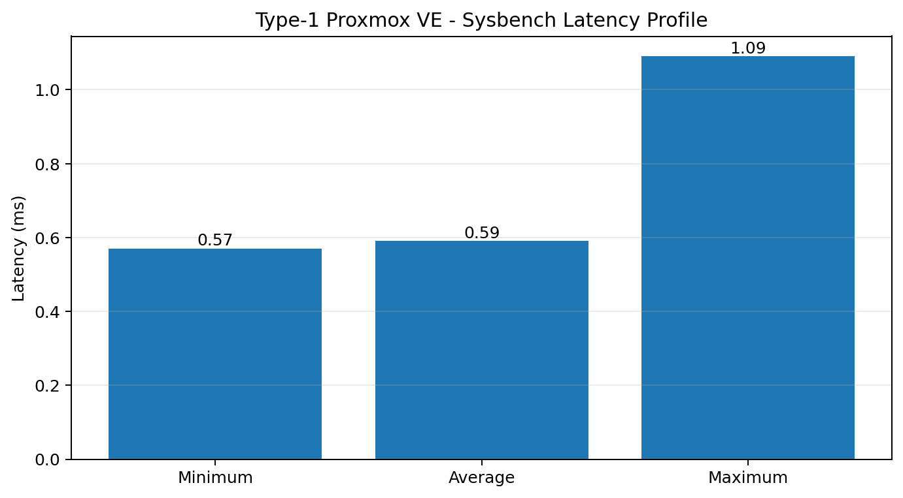
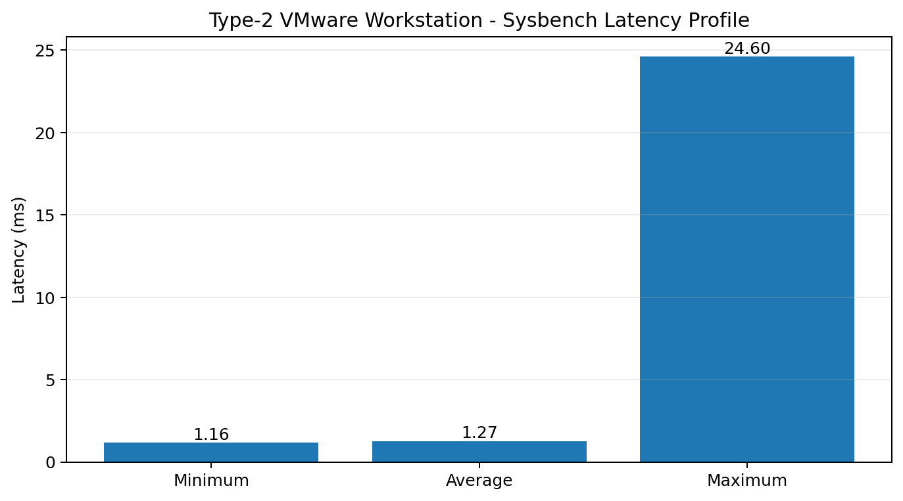
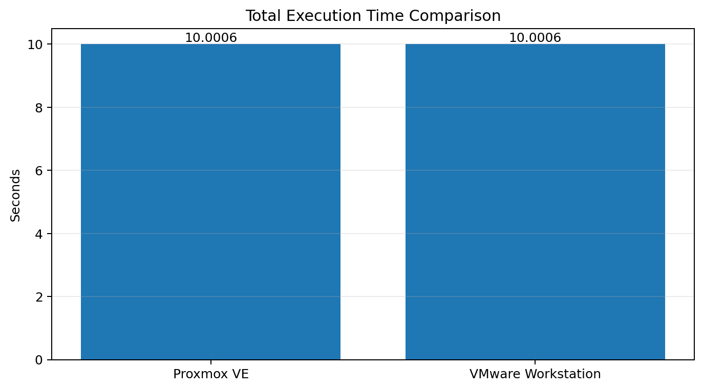
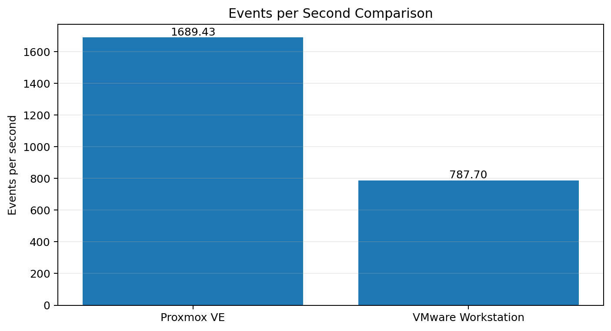
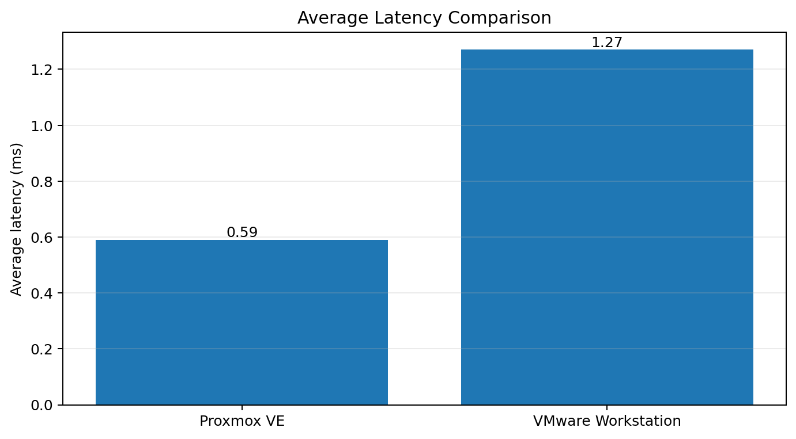

<h1 align="center">Type-1 vs Type-2 Hypervisor Performance Analysis</h1>

<p align="center">Performance analysis of virtual machines running on Proxmox VE and VMware Workstation using Sysbench.</p>

<h2>1. Experiment Objective</h2>

This experiment compares a virtual machine running on a Type-1 hypervisor and a Type-2 hypervisor using the same main VM configuration and the same CPU benchmark.

Type-1 Hypervisor: Proxmox VE  
Type-2 Hypervisor: VMware Workstation

Benchmark command:

```bash
sysbench cpu --cpu-max-prime=20000 run
```

<h2>2. Standard Virtual Machine Configuration</h2>

| Resource | Configuration |
|---|---|
| Guest Operating System | Ubuntu 22.04 |
| CPU | 2 vCPU |
| Memory | 2 GB RAM |
| Disk | 20 GB |
| Benchmark Tool | Sysbench |

<h2>3. Type-1 Hypervisor Analysis - Proxmox VE</h2>

| Parameter | Value |
|---|---|
| Hypervisor | Proxmox VE |
| Hypervisor Type | Type-1 |
| Guest OS | Ubuntu |
| CPU | 2 vCPU |
| Memory | 2 GB |
| Disk | 20 GB |

| Sysbench Metric | Result |
|---|---:|
| Total Execution Time | 10.0006 s |
| Total Events | 16903 |
| Events per Second | 1689.43 |
| Minimum Latency | 0.57 ms |
| Average Latency | 0.59 ms |
| Maximum Latency | 1.09 ms |



<h2>4. Type-2 Hypervisor Analysis - VMware Workstation</h2>

| Parameter | Value |
|---|---|
| Hypervisor | VMware Workstation |
| Hypervisor Type | Type-2 |
| Guest OS | Ubuntu 22.04 |
| CPU | 2 vCPU |
| Memory | 2 GB |
| Disk | 20 GB |
| Network | NAT |

| Sysbench Metric | Result |
|---|---:|
| Total Execution Time | 10.0006 s |
| Total Events | 7879 |
| Events per Second | 787.70 |
| Minimum Latency | 1.16 ms |
| Average Latency | 1.27 ms |
| Maximum Latency | 24.60 ms |



<h2>5. Proper Performance Comparison</h2>

| Parameter | Type-1 Proxmox VE | Type-2 VMware Workstation |
|---|---:|---:|
| Total Execution Time | 10.0006 s | 10.0006 s |
| Total Events | 16903 | 7879 |
| Events per Second | 1689.43 | 787.70 |
| Average Latency | 0.59 ms | 1.27 ms |

<h3>Total Execution Time</h3>


<h3>Total Events</h3>


<h3>Events per Second</h3>


<h3>Average Latency</h3>


<h2>6. Observations</h2>

- Both hypervisors used the same main VM resource configuration and the same Sysbench CPU benchmark.
- Both benchmark runs completed in approximately 10 seconds.
- In this experiment, Proxmox recorded more total benchmark events and a higher events-per-second value than VMware Workstation.
- The measured average latency was 0.59 ms for Proxmox and 1.27 ms for VMware.
- The results show measurable performance differences between the two virtualization environments under the tested configuration.

<h2>7. Screenshot Evidence</h2>

Type-1 Proxmox screenshots are stored in `screenshots/type1-proxmox/`.

Type-2 VMware screenshots are stored in `screenshots/type2-vmware/`.

The final comparison screenshot is stored in `screenshots/comparison/01-hypervisor-performance-comparison.png`.

<h2>8. Detailed Results</h2>

Detailed benchmark values are available in `results/performance-analysis.md`.

<h2>9. Repository Structure</h2>

```text
CC-Experiment-01-Hypervisor-Analysis/
|
+-- screenshots/
|   +-- type1-proxmox/
|   +-- type2-vmware/
|   +-- comparison/
|
+-- results/
|   +-- performance-analysis.md
|   +-- graphs/
|
+-- README.md
```
